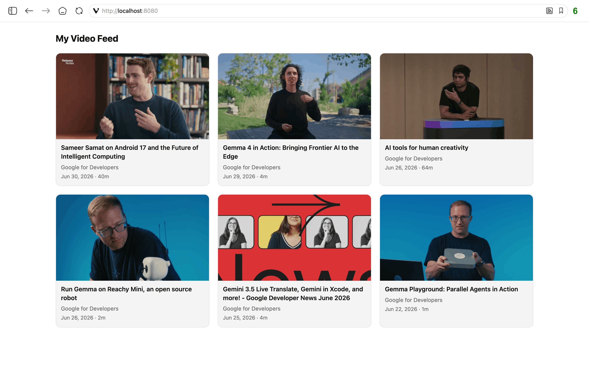

# Personal Video Feed

[](https://github.com/mrgall/my-video-feed/actions/workflows/ci.yml)

Aggregate YouTube channel uploads into a single filtered, chronological Atom
feed (plus an HTML page), so you can follow subscriptions in publish order
instead of YouTube's algorithmic homepage. It polls channel feeds (or receives
[PubSubHubbub](https://en.wikipedia.org/wiki/PubSubHubbub) push), drops Shorts,
livestreams, and blacklisted titles, and republishes the rest. Runs on SQLite by
default; MySQL/MariaDB is optional.



## Features

- Single aggregate Atom feed (`/channels`) and HTML page (`/`) across all
  subscribed channels, with title cleanup, duration display, and optional
  thumbnail upgrade.
- Title-substring blacklist and a minimum-duration filter to drop Shorts.
- Optional YouTube Data API v3 key for accurate duration and to skip
  livestreams/private videos.
- Optional PubSubHubbub subscriber (instant inbound updates) and publisher
  (notifies a hub on change), independently toggleable; runs fine poll-only.

## Quick start (Docker)

```
cp .env.example .env      # SQLite works out of the box
docker compose up -d --build
docker compose exec myvideofeed php bin/myvideofeed db:init
docker compose exec myvideofeed php bin/myvideofeed channel:add UCxxxxxxxxxxxxxxxxxxxxxxxx
docker compose exec myvideofeed php bin/myvideofeed ingest
curl http://localhost:8080/channels
```

For MySQL/MariaDB, set `DB_DRIVER=mysql`, `DB_HOST=database`, and
`DB_NAME`/`DB_USER`/`DB_PASS` in `.env` (these also seed the bundled `database`
container), then start with `docker compose --profile mysql up -d`.

### Two run modes

The default **php-cli** mode (`Dockerfile` + `compose.yaml`) serves the app with
PHP's built-in `php -S`. A **php-fpm + nginx** mode (`Dockerfile.fpm` +
`compose.fpm.yaml`) is also provided; add `-f compose.fpm.yaml` to every compose
command. Both are otherwise identical (same `.env`, host `:8080`, and
`myvideofeed` container name). Use one at a time - `docker compose down` before
switching.

### Cron

There is no in-container scheduler. Point an external crontab at the CLI hourly:

```
7 * * * *  docker exec myvideofeed php bin/myvideofeed cron
```

## Bare-metal install

Requires PHP 8.3+ with `pdo_sqlite` (or `pdo_mysql`), `curl`, `simplexml`,
`mbstring`.

```
composer install
cp config.example.php config.php   # or set the equivalent env vars
php bin/myvideofeed db:init
php bin/myvideofeed channel:add UCxxxxxxxxxxxxxxxxxxxxxxxx
php bin/myvideofeed ingest
php -S localhost:8080 -t public    # or point a web server at public/
```

Add the same hourly cron line as above, without the `docker exec` wrapper.

## Configuration

Copy `config.example.php` to `config.php` (bare metal) or `.env.example` to
`.env` (Docker) and edit. Every key falls back to an environment variable.

| Group | Purpose |
|---|---|
| `timezone` | `TZ` for `cron.*` scheduling and human-readable output; storage stays UTC |
| `base_url` | This app's public base URL (`APP_URL`); feed URL, Atom id/self link, PubSubHubbub callbacks, and the inbound routing prefix all derive from it |
| `db.*` | `driver` (`sqlite`\|`mysql`) plus SQLite path or MySQL connection details |
| `youtube_key` | Optional YouTube Data API v3 key (see below) |
| `feed.*` | Aggregate feed title |
| `subscriber.*` | Optional PubSubHubbub subscribe; set `url` to enable, empty for poll-only |
| `publisher.*` | Optional hub notify on change; set `url` to enable (also becomes the feed's hub link) |
| `filter.*` | Min duration, title strip patterns, title prefix, `exclude_tags` (skip videos with these YouTube tags; needs API key), `upgrade_thumbnail` (default off; swaps `hqdefault`→`maxres2`) |
| `cron.*` | Hours `cron` ingests at, and the weekly subscribe-refresh day/hour |
| `audit_log` | Where "not viewable" skipped videos get logged |

**Optional YouTube API key** - without it, videos still ingest but with duration
unknown and no livestream/private detection, so the short-video filter and `(Nm)`
suffix don't apply. Get a free key from the
[Google Cloud Console](https://console.cloud.google.com/) (enable "YouTube Data
API v3").

**Subscriber** - set `subscriber.url` to a PubSubHubbub hub (e.g. Google's free
public hub `pubsubhubbub.appspot.com`) and YouTube pushes new uploads to this
app's `/<channel_id>` callback instead of waiting for the next poll. Leave it
empty to rely on polling.

**Publisher** - set `publisher.url` to a hub's publish endpoint (e.g.
[Superfeedr](https://superfeedr.com/)) to notify it when the aggregate feed
changes; that URL is then declared as the feed's `<link rel="hub">`. Independent
of the subscriber.

## CLI commands

```
bin/myvideofeed db:init                  Create the schema for the configured driver
bin/myvideofeed cron                     Hourly entrypoint (respects cron.* gating)
bin/myvideofeed ingest                   Force-process all active channels now
bin/myvideofeed subscribe                Force-refresh PubSubHubbub subscriptions now
bin/myvideofeed channel:add <id>         Add a channel by YouTube channel id (UC...)
bin/myvideofeed channel:list             List channels
bin/myvideofeed blacklist:add <term>     Add a title-match term to the blacklist
bin/myvideofeed blacklist:list           List blacklist terms
```

## Web routes

Routes live under `base_url`'s path prefix, if any.

- `/` - HTML card grid of recent videos
- `/channels` - the aggregate Atom feed
- `/<channel_id>` - PubSubHubbub callback (verification GET, push POST) and
  manual poll trigger
- `/subscribe` - manually refresh subscriptions
- `/excluded`, `/included` - debug listings of blacklisted vs. included videos

## Tests

```
composer install
vendor/bin/phpunit
```

## License

MIT - see [LICENSE](LICENSE).
